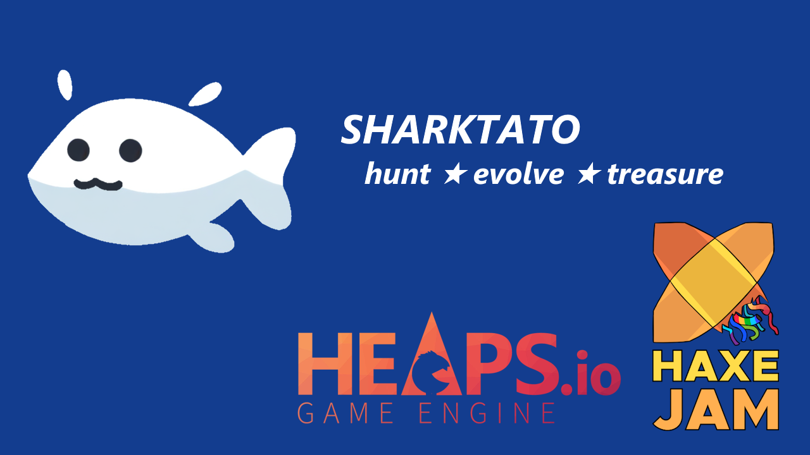
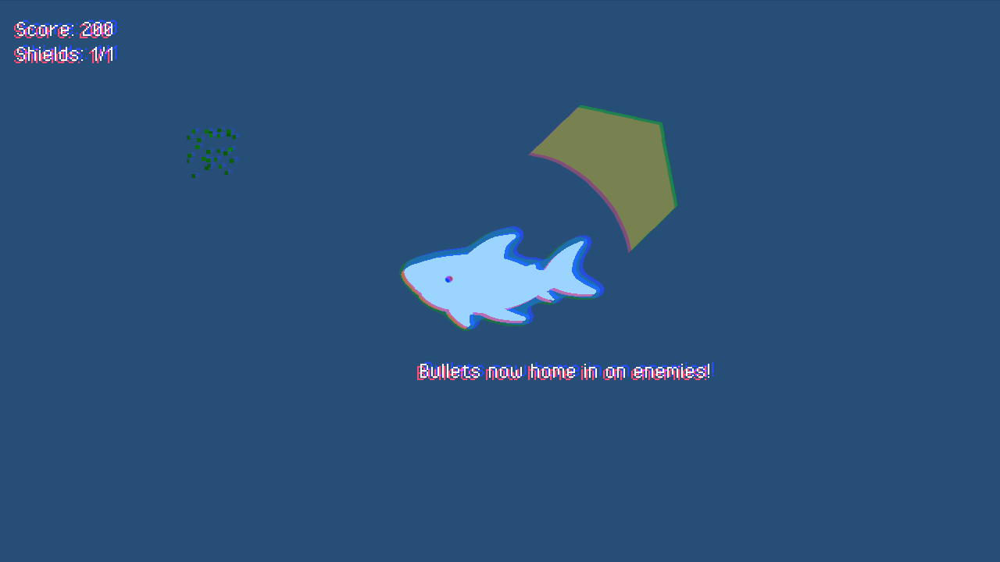
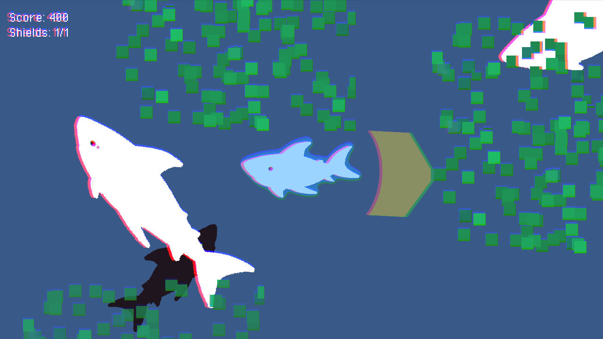

# sharktato-haxejam2024
Game made for HaxeJam 2024.

## Screenshots

<p align="center">
  
   
  
</p>

## How to build

Download `heaps`:

```
haxelib install heaps
```

Open project in VSCode.

Change path to your browser at `.vscode/launch.json`
```
"runtimeExecutable": "C:/Users/geork/AppData/Local/Yandex/YandexBrowser/Application/browser.exe", //! Change path to your browser
```

Run project with F5.

It will generate `.js` and `.map` files and will open browser with game.

